

  <picture>
    <source media="(max-width: 600px)" srcset="./assets/hero-mobile.svg" />
    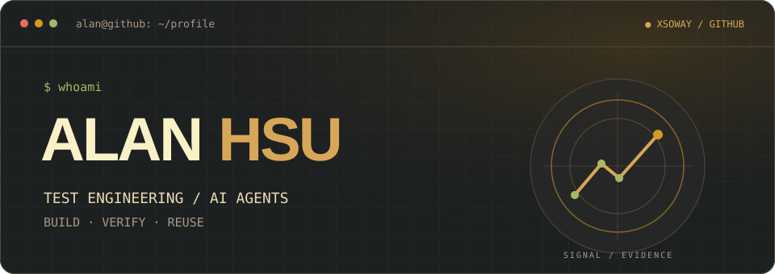
  </picture>
   
  
  
   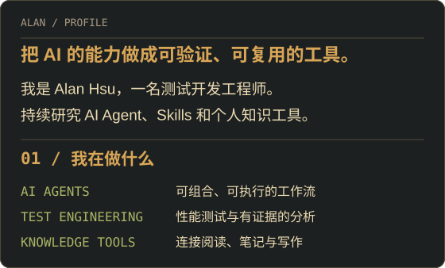
   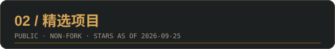
   <a href="https://github.com/xsoway/codebase-graph-prd-rules">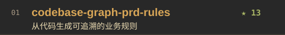</a>
   <a href="https://github.com/xsoway/locust-perf-framework">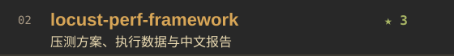</a>
   <a href="https://github.com/xsoway/skill-spec">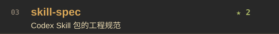</a>
   <a href="https://github.com/xsoway/oss-release-prep">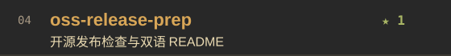</a>
   <a href="https://github.com/xsoway/obsidian-ai-vault-scaffold">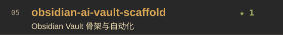</a>
   <a href="https://github.com/xsoway/echo-me-skill">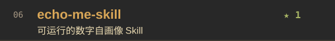</a>
   <a href="https://github.com/xsoway/wx_upload_cover_tool">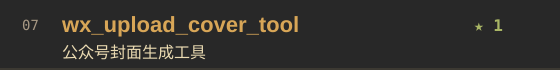</a>
   <a href="https://github.com/xsoway/llm-wiki-knowledge-vault">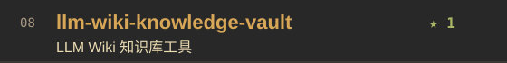</a>
   <a href="https://github.com/xsoway/editor-html">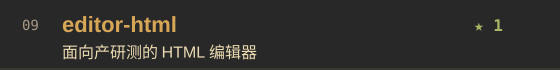</a>
   
  
  
  
  
  
   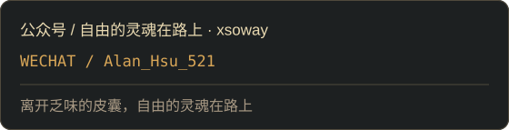

